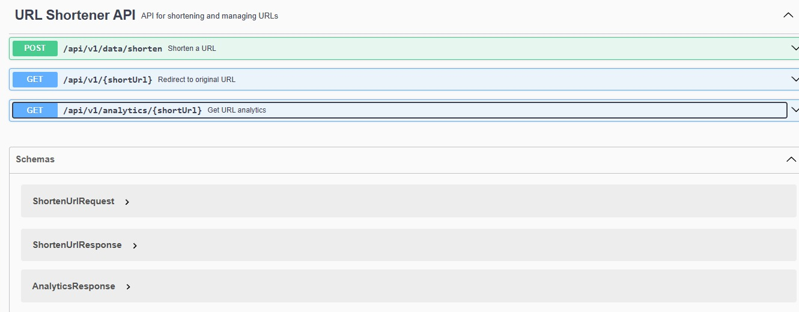
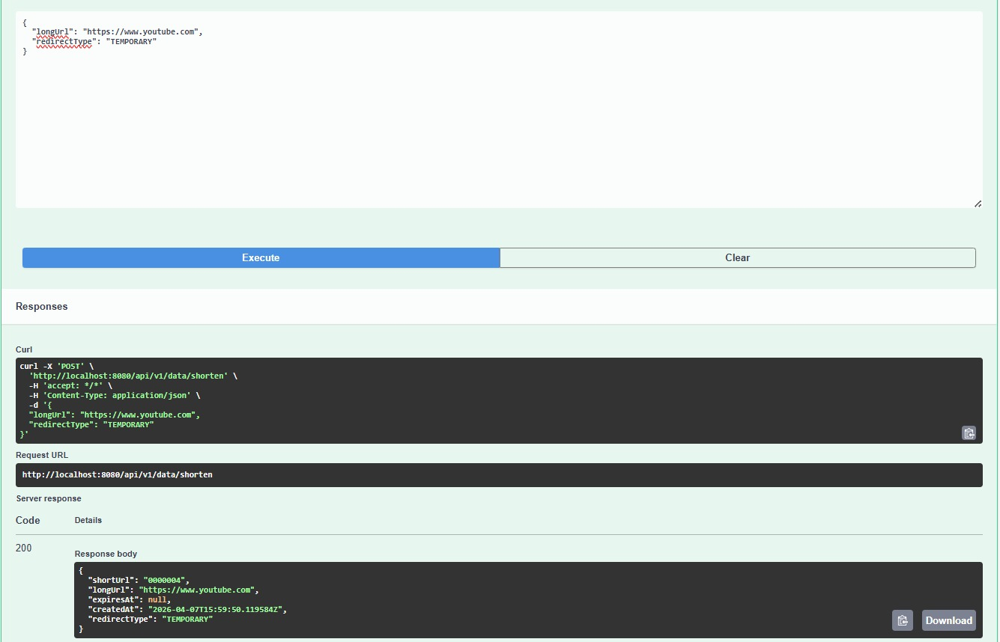
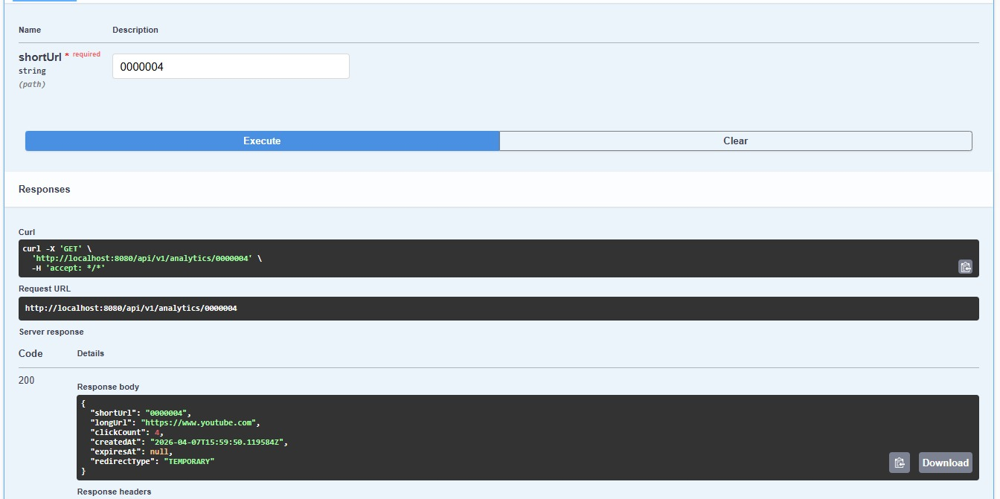
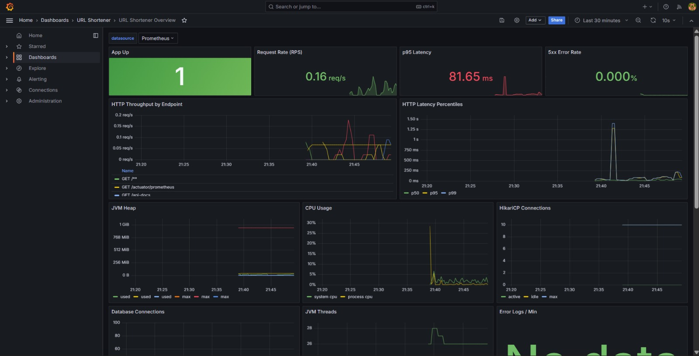
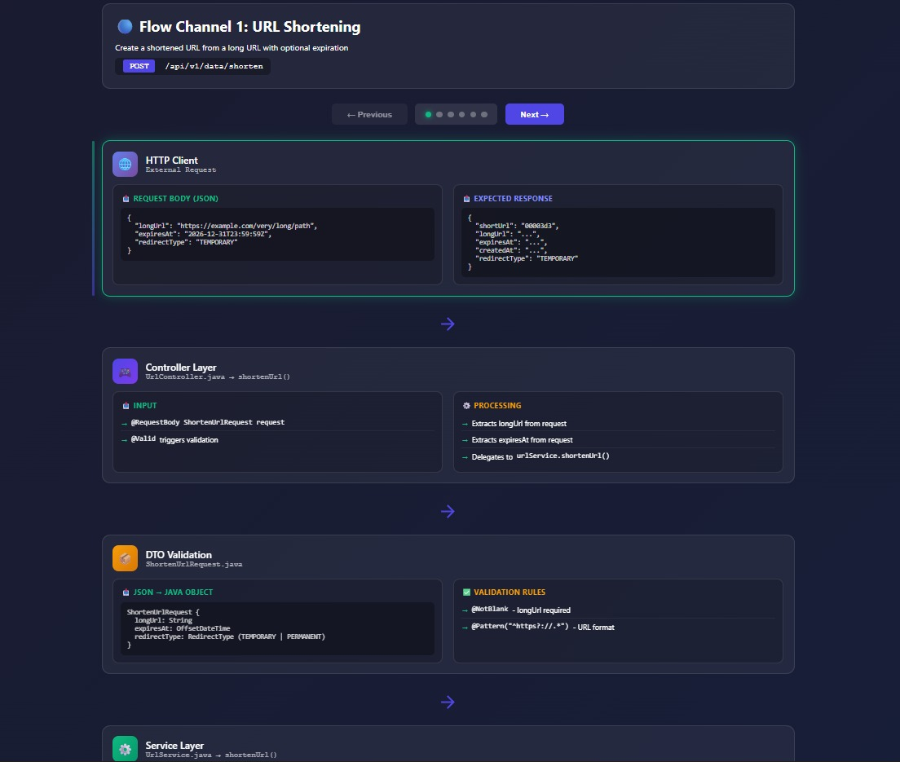
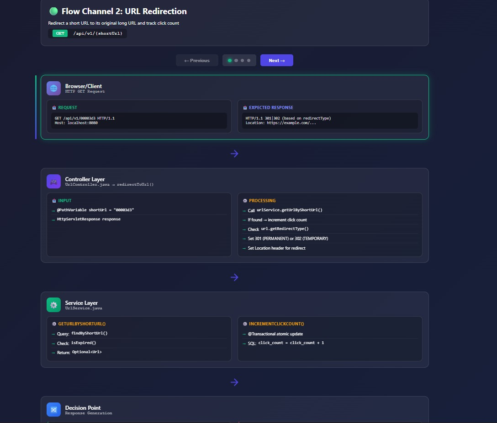

# URL Shortener Service

A scalable URL shortener service built with Spring Boot, PostgreSQL, Redis, and Docker — featuring monitoring with Prometheus and Grafana.

## Features

- **URL Shortening**: Convert long URLs to short, unique identifiers
- **URL Redirection**: 301 permanent redirects to original URLs
- **Click Analytics**: Track click counts for shortened URLs
- **URL Expiration**: Optional expiration dates for temporary URLs
- **Caching**: Redis-based caching for improved performance
- **API Documentation**: OpenAPI/Swagger documentation

## Technology Stack

- **Backend**: Java 17, Spring Boot 3.2
- **Database**: PostgreSQL
- **Cache**: Redis
- **Build Tool**: Maven
- **Containerization**: Docker

## Screenshots

### Swagger UI — API Overview
All three REST endpoints exposed by the service: shorten, redirect, and analytics.



### Swagger UI — Shorten URL
`POST /api/v1/data/shorten` returns a 7-character base62 short code with redirect type and creation timestamp.



### Swagger UI — Click Analytics
`GET /api/v1/analytics/{shortUrl}` returns click count, original URL, and metadata for any shortened URL.



---

### Grafana — Live Monitoring Dashboard
Real-time metrics via Prometheus: request rate, p95 latency, 5xx error rate, JVM heap, CPU usage, HikariCP connection pool, and JVM threads — all auto-provisioned on startup.



---

### Data Flow — URL Shortening
Step-by-step visualization of the `POST /shorten` flow: HTTP client → Controller → DTO validation → Service layer → base62 encoding → PostgreSQL persistence.



### Data Flow — URL Redirection
Step-by-step visualization of the `GET /{shortUrl}` flow: Browser → Controller → Service lookup → expiry check → click count increment → 301/302 redirect response.



## Quick Start

### Prerequisites
- Java 17+
- Docker and Docker Compose
- Maven 3.6+

### Running with Docker Compose

1. Clone the repository
2. Start the services:
   ```bash
   docker-compose up --build
   ```
3. The application will be available at `http://localhost:8080`
4. API documentation at `http://localhost:8080/swagger-ui.html`

### Running Locally

1. Start PostgreSQL and Redis:
   ```bash
   docker-compose up db redis
   ```

2. Update `application.properties` with your database credentials

3. Run the application:
   ```bash
   mvn spring-boot:run
   ```

## API Endpoints

### Shorten URL
```http
POST /api/v1/data/shorten
Content-Type: application/json

{
  "longUrl": "https://www.example.com/very/long/url",
  "expiresAt": "2027-12-31T23:59:59Z"  // optional
}
```

### Redirect to URL
```http
GET /api/v1/{shortUrl}
```

### Get Analytics
```http
GET /api/v1/analytics/{shortUrl}
```

## API Testing with Httpie

The project includes Httpie request files and a testing script for easy API testing.

### Using the Testing Script
```bash
# Make script executable (if not already)
chmod +x test-api.sh

# Run all tests
./test-api.sh all

# Run specific tests
./test-api.sh health
./test-api.sh shorten
./test-api.sh info
./test-api.sh metrics
./test-api.sh docs
```

### Using Httpie Directly
```bash
# Install Httpie if not already installed
pip install httpie

# Run individual requests
http --session=./session.json POST http://localhost:8080/api/v1/data/shorten \
  Content-Type:application/json \
  longUrl="https://www.example.com/test"

# Or run all requests from the HTTP file
httpie --session=./session.json < api-requests.http
```

### Available Test Requests
- **Shorten URL**: Create short URLs with or without expiration
- **Redirect**: Test URL redirection (replace `{shortUrl}` with actual short URL)
- **Analytics**: Get click analytics for shortened URLs
- **Health Check**: Verify service health
- **API Docs**: Access Swagger UI

### Using the JSON File
The `api-requests.json` file contains request definitions that can be used programmatically or with Httpie collections.

## API Testing with Postman

Import the Postman collection for GUI-based API testing.

### Importing the Collection
1. Open Postman
2. Click "Import" button
3. Select "File"
4. Choose `url-shortener-postman-collection.json`
5. Optionally import `url-shortener-postman-environment.json` for environment variables
6. The collection will be imported with all endpoints

### Setting Up Environment
1. Import the environment file: `url-shortener-postman-environment.json`
2. Select "URL Shortener Environment" from the environment dropdown
3. Update the `shortUrl` variable with an actual short URL from a successful shorten request
4. The `base_url` is pre-configured for local development
5. Update `metricName` for specific metrics (e.g., `jvm.memory.used`, `http.server.requests`)
6. Update `component` for health checks (e.g., `db`, `redis`, `diskSpace`)

### Available Requests
- **Shorten URL with Expiration**: POST request with JSON body including expiration date
- **Shorten URL (Simple)**: POST request with just the long URL
- **Redirect to Original URL**: GET request using the `{{shortUrl}}` variable
- **Get URL Analytics**: GET request to retrieve click analytics
- **Health Check**: GET request to verify service health
- **Application Info**: GET request for application information
- **Application Metrics**: GET request for application metrics overview
- **Specific Metric**: GET request for detailed metric information using `{{metricName}}`
- **Health Component**: GET request for specific health component status using `{{component}}`
- **API Documentation**: GET request to access Swagger UI

### Testing Workflow
1. Run "Shorten URL" request to get a short URL
2. Copy the short URL from the response and update the `shortUrl` variable
3. Test the redirect and analytics endpoints
4. Use health check to verify service status

## Architecture

The service follows a layered architecture:
- **Controller Layer**: REST API endpoints (`UrlController`)
- **Service Layer**: Business logic with Redis caching (`UrlService`)
- **Repository Layer**: JPA data access (`UrlRepository`)
- **Entity Layer**: Domain models (`Url`, `RedirectType`)
- **Scheduler**: Hourly expired URL cleanup (`ExpiredUrlCleanupTask`)
- **Util**: Base62 encoding for short code generation (`Base62Encoder`)

## Development

### Running Tests
```bash
mvn test
```

### Code Coverage
```bash
mvn jacoco:report
```

### Building
```bash
mvn clean package
```

## Logging

The application uses structured JSON logging for better log analysis and monitoring:

- **Format**: JSON with timestamp, level, logger, message, thread, and MDC
- **SQL Queries**: Suppressed (only errors shown)
- **File Logging**: Logs are written to `logs/url-shortener.log` with rotation
- **Log Levels**:
  - Application code: INFO
  - Spring Web: INFO
  - Hibernate SQL: ERROR (suppressed)
  - Redis: INFO

### Log Example:
```json
{"timestamp":"2026-04-07T10:30:00.000+05:30","level":"INFO","logger":"com.urlshortener.controller.UrlController","message":"URL shortened successfully","thread":"http-nio-8080-exec-1"}
```

### Viewing Logs:
```bash
# Console logs (JSON format)
tail -f logs/url-shortener.log

# Pretty print JSON logs
tail -f logs/url-shortener.log | jq .
```

## Monitoring

- Health checks: `/actuator/health`
- Metrics: `/actuator/metrics`
- Info: `/actuator/info`
- Prometheus format metrics: `/actuator/prometheus`

### Grafana + Prometheus Setup

The project includes pre-configured Prometheus and Grafana services in `docker-compose.yml`.

Start all services:

```bash
docker-compose up --build
```

Access monitoring tools:

- **Prometheus UI**: `http://localhost:9090`
- **Grafana UI**: `http://localhost:3001`
  - Username: `admin`
  - Password: `admin`

Grafana is auto-provisioned with a default Prometheus datasource (`http://prometheus:9090`).
It also auto-loads the **URL Shortener Overview** dashboard in the **URL Shortener** folder.

The dashboard includes:

- Request throughput (RPS)
- 5xx error rate
- P95/P99 request latency
- JVM heap used/max
- Process CPU usage
- Live JVM threads

## Load Testing with K6

K6 test scripts are available under `k6/`:

- `k6/smoke-test.js`: quick health + shorten + redirect sanity test
- `k6/load-test.js`: ramping VU load profile for shorten/redirect/analytics endpoints

### Prerequisites

- Install K6 (macOS):

```bash
brew install k6
```

### Run Smoke Test

```bash
k6 run k6/smoke-test.js
```

### Run Load Test

```bash
k6 run k6/load-test.js
```

### Custom Base URL

Use `BASE_URL` for non-local environments:

```bash
BASE_URL=http://localhost:8080 k6 run k6/load-test.js
```

## Contributing

1. Fork the repository
2. Create a feature branch
3. Write tests for new features
4. Ensure code coverage > 80%
5. Submit a pull request

## License

This project is licensed under the MIT License.